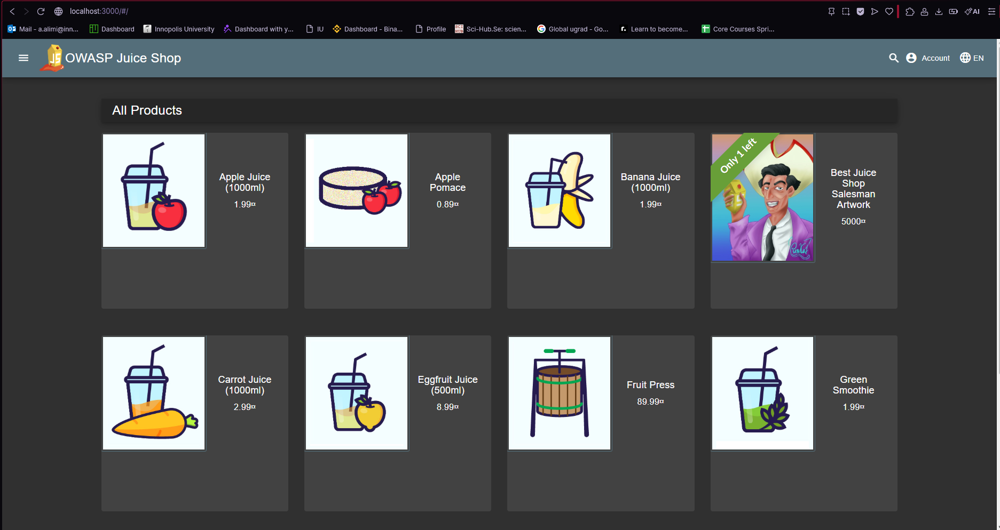

# Triage Report — OWASP Juice Shop

## Scope & Asset
- Asset: OWASP Juice Shop (local lab instance)
- Image: bkimminich/juice-shop:v19.0.0
- Release link/date: [v19.0.0](https://github.com/juice-shop/juice-shop/releases/tag/v19.0.0) —  Sep 4, 2025
- Image digest: sha256:2765a26de7647609099a338d5b7f61085d95903c8703bb70f03fcc4b12f0818d

## Environment
- Host OS: Windows 11
- Docker: `Docker version 29.2.0, build 0b9d198`

## Deployment Details
- Run command used: `docker run -d --name juice-shop -p 127.0.0.1:3000:3000 bkimminich/juice-shop:v19.0.0`
- Access URL: http://127.0.0.1:3000
- Network exposure: 127.0.0.1 only [x] Yes  [ ] No

## Health Check

### Page Load
✅ Homepage loads successfully in browser at http://127.0.0.1:3000



### API Check

**Initial attempt with `/rest/products`:**
```
Result: 500 Internal Server Error
Error from logs: "Unexpected path: /rest/products"
```

**Successful alternative endpoint `/api/Products`:**
```json
{
  "status": "success",
  "data": [
    {"id":1,"name":"Apple Juice (1000ml)","description":"The all-time classic.","price":1.99},
    {"id":2,"name":"Orange Juice (1000ml)","description":"Made from oranges hand-picked by Uncle Dittmeyer.","price":2.99},
    {"id":3,"name":"Eggfruit Juice (500ml)","description":"Now with even more exotic flavour.","price":8.99},
    {"id":4,"name":"Raspberry Juice (1000ml)","description":"Made from blended Raspberry Pi, water and sugar.","price":4.99},
    {"id":5,"name":"Lemon Juice (500ml)","description":"Sour but full of vitamins.","price":2.99}
  ]
}
```
*(First 5 products shown for brevity)*

**Docker Logs Verification:**
```
info: Server listening on port 3000
info: Restored 1-star errorHandlingChallenge (Error Handling)
```

## Surface Snapshot (Triage)

- Login/Registration visible: [x] Yes  [ ] No — notes: Registration and login buttons visible in top-right navigation bar
- Product listing/search present: [x] Yes  [ ] No — notes: Product catalog displayed on homepage with functional search bar
- Admin or account area discoverable: [x] Yes  [ ] No — notes: Account menu accessible after login, admin panel likely exists
- Client-side errors in console: [ ] Yes  [x] No — notes: Opened browser DevTools (F12), no JavaScript errors on initial page load
- Security headers (quick look):
  ```
    Key                         Value
    ---                         -----
    Access-Control-Allow-Origin *
    X-Content-Type-Options      nosniff
    X-Frame-Options             SAMEORIGIN
    Feature-Policy              payment 'self'
    X-Recruiting                /#/jobs
    Vary                        Accept-Encoding
    Connection                  keep-alive
    Keep-Alive                  timeout=5
    Accept-Ranges               bytes
    Content-Length              75002
    Cache-Control               public, max-age=0
    Content-Type                text/html; charset=UTF-8
    Date                        Sun, 08 Feb 2026 22:33:45 GMT
    ETag                        W/"124fa-19c3f457f45"
    Last-Modified               Sun, 08 Feb 2026 22:00:45 GMT
  ```

  **Analysis:**
- ✅ `X-Content-Type-Options: nosniff` - Prevents MIME-type sniffing
- ✅ `X-Frame-Options: SAMEORIGIN` - Protects against clickjacking
- ⚠️ `Access-Control-Allow-Origin: *` - Overly permissive CORS policy
- ❌ Missing `Content-Security-Policy` - No CSP protection against XSS
- ❌ Missing `Strict-Transport-Security` - No HTTPS enforcement
## Risks Observed (Top 3)

1. **SQL Injection Vulnerability** — Login forms and search functionality are likely vulnerable to SQL injection attacks, as Juice Shop is designed to demonstrate OWASP Top 10 vulnerabilities. Input validation appears minimal.

2. **Cross-Site Scripting (XSS)** — Product search, reviews, and user input fields may allow script injection. The application appears to render user-supplied content without proper sanitization.

3. **API Path Inconsistency/Information Disclosure** — The error message "Unexpected path: /rest/products" reveals internal routing logic and suggests incomplete API access controls. Alternative endpoints like `/api/Products` work, indicating potential security through obscurity rather than proper access control.

---

## Task 2 — PR Template Setup

### Template Creation Process

Created `.github/pull_request_template.md` on the `main` branch with standardized sections:
- **Goal:** Describes the purpose of the PR
- **Changes:** Lists key files added or modified
- **Testing:** Documents verification steps
- **Artifacts & Screenshots:** Provides evidence
- **Checklist:** 3-item quality control checklist

### Implementation Steps

1. Checked out `main` branch
2. Created `.github` directory
3. Added `pull_request_template.md` with required format
4. Committed and pushed to `main` branch
5. Switched back to `lab1` branch for actual lab work
6. Merged the change to `lab1` (because it was created before the pull request template file)
6. Verified template auto-fills when creating PR

### Verification Evidence

✅ Template file exists at `.github/pull_request_template.md`
✅ File committed to `main` branch before creating feature branch
✅ PR creation page automatically populates with template sections
✅ All checklist items are functional and tickable

### Workflow Analysis

**How PR templates improve collaboration:**

1. **Consistency:** Every contributor follows the same structure, making reviews predictable and efficient
2. **Completeness:** Checklists prevent common oversights (missing docs, exposed secrets)
3. **Context:** Standardized sections ensure reviewers have all necessary information upfront
4. **Quality Control:** Forces submitters to verify testing and documentation before requesting review
5. **Onboarding:** New contributors immediately understand expectations without reading separate guidelines

---

## Task 6 — GitHub Community Engagement

### Actions Completed

✅ Starred course repository
✅ Starred: [simple-container-com/api](https://github.com/simple-container-com/api)  
✅ Followed instructor: [@Cre-eD](https://github.com/Cre-eD)  
✅ Followed TAs: [@marat-biriushev](https://github.com/marat-biriushev), [@pierrepicaud](https://github.com/pierrepicaud)  
✅ Followed 3 classmates: [@abdughafforzoda](https://github.com/abdughafforzoda),[@Boogyy](https://github.com/Boogyy), [@mpasgat](https://github.com/mpasgat)

### Reflection

**Why starring repositories matters in open source:**

Starring repositories serves as both a personal bookmark system and a community signal. Stars help developers rediscover useful projects, encourage maintainers by showing appreciation, and indicate project quality to new users. High star counts improve project visibility in GitHub search and recommendations, creating a positive feedback loop that attracts contributors and builds trust in the open-source ecosystem.

**How following developers helps in team projects and professional growth:**

Following classmates, instructors, and industry professionals creates a real-time learning feed of their commits, projects, and contributions. This enables peer learning, helps discover new tools and techniques, and builds professional networks beyond the classroom. In team projects, it simplifies collaboration by making it easy to track teammates' work and share discoveries. Long-term, a curated network of followed developers keeps you informed about industry trends and creates visibility for career opportunities.

---

## Challenges & Solutions

### Challenge 1: `/rest/products` API Endpoint Failure
**Problem:** Initial API endpoint returned 500 error  
**Solution:** Discovered working alternative `/api/Products` endpoint through log analysis  
**Learning:** Importance of checking application logs and testing multiple endpoints

### Challenge 2: PowerShell curl Alias
**Problem:** `curl` command behaved differently than expected on Windows  
**Solution:** Used `Invoke-WebRequest` with `-UseBasicParsing` flag  
**Learning:** Platform-specific command differences require adaptation

---

## Conclusion

Successfully deployed OWASP Juice Shop in an isolated local environment, completed security triage identifying key vulnerability areas, established a repeatable PR workflow, and engaged with the GitHub development community. The lab demonstrated practical DevSecOps skills including containerization, security assessment, and collaborative development practices.