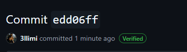
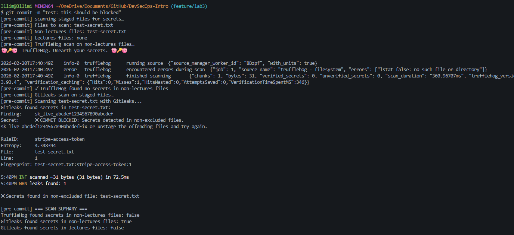
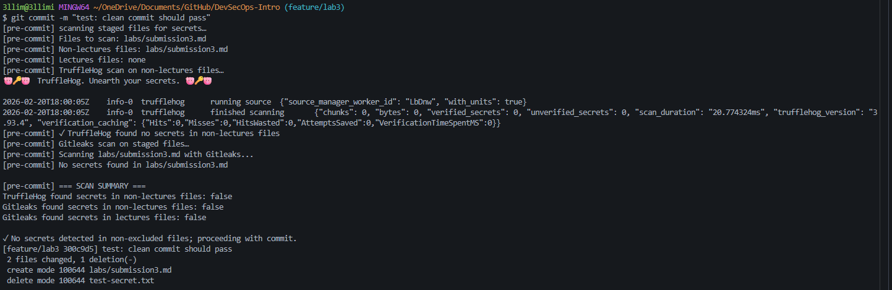

# Lab 3 — Secure Git Submission

**Name:** Baha Alimi  
**Email:** a.alimi@innopolis.university

---

## Task 1 — SSH Commit Signature Verification

### 1.1 Benefits of Commit Signing

Commit signing ensures that every commit can be cryptographically verified as coming from a trusted author. Without signing, anyone can impersonate another developer by simply setting `git config user.name` and `git config user.email` to someone else's identity — Git does not verify this by default. Signed commits solve this by attaching a cryptographic signature that can only be produced by the holder of the private key.

Key benefits:
- **Authenticity** — proves the commit was made by the claimed author
- **Integrity** — guarantees the commit content has not been tampered with
- **Non-repudiation** — the author cannot deny making the commit
- **Supply chain security** — prevents malicious code injection by impersonators

### 1.2 SSH Key Setup and Configuration

Generated an ed25519 SSH key and added it to GitHub as both an **Authentication Key** and a **Signing Key**.

Git global configuration:

```
user.name=Baha Alimi
user.email=a.alimi@innopolis.university
user.signingkey=~/.ssh/id_ed25519.pub
gpg.format=ssh
commit.gpgsign=true
```

Commands used to configure signing:

```bash
ssh-keygen -t ed25519 -C "a.alimi@innopolis.university"

git config --global gpg.format ssh
git config --global user.signingkey "~/.ssh/id_ed25519.pub"
git config --global commit.gpgSign true
```

> **Note:** The SSH key was added to GitHub twice — once as an Authentication Key (for push/pull) and once as a Signing Key (for the "Verified" badge on commits).

### 1.3 Verified Badge on GitHub

After pushing the signed commit to GitHub, the "Verified" badge appeared on the commit in the repository.

> 

### 1.4 Why Commit Signing is Critical in DevSecOps Workflows

In DevSecOps, the software supply chain is a major attack surface. Unsigned commits create a trust gap — CI/CD pipelines, automated deployments, and code reviews cannot distinguish between a legitimate developer and an attacker who has compromised credentials or is impersonating someone.

Signed commits close this gap in several ways:

1. **Pipeline enforcement** — GitHub branch protection rules can require verified commits, blocking any unverified code from being merged into protected branches like `main`.
2. **Audit trails** — signed commits create a tamper-evident log that security teams can rely on during incident response to confirm who made which changes.
3. **Insider threat mitigation** — even within an organization, signing prevents one developer from pushing code under another developer's identity.
4. **Compliance** — many security frameworks (SOC 2, ISO 27001) require evidence of code integrity controls, which signed commits directly satisfy.

In short, commit signing is a low-effort, high-impact control that anchors trust in the entire software delivery chain.

> 

---

## Task 2 — Pre-commit Secret Scanning

### 2.1 Hook Setup

Created `.git/hooks/pre-commit` using Git Bash with the lab-provided script. Two Windows-specific fixes were applied to make Docker work correctly:

1. Added `export MSYS_NO_PATHCONV=1` at the top of the script to prevent Git Bash from converting Unix paths (e.g. `/repo`) into Windows paths that Docker cannot use.
2. Switched Docker context from `desktop-linux` to `default` to fix the Docker daemon connection issue on Windows.

The hook was made executable with:

```bash
chmod +x .git/hooks/pre-commit
```

### 2.2 How the Hook Works

On every `git commit`, the hook:

1. Collects all staged files
2. Separates them into `lectures/` files (educational content, allowed) and non-lectures files (scanned strictly)
3. Runs **TruffleHog** via Docker on non-lectures files to detect secrets
4. Runs **Gitleaks** via Docker on each staged file to detect secrets using pattern matching
5. Blocks the commit if either tool finds secrets in non-lectures files
6. Allows commits with secrets only in the `lectures/` directory (educational content)

### 2.3 Test Results — Blocked Commit

Created a test file containing a fake Stripe API key:

```bash
echo 'sk_live_************************' > test-secret.txt
git add test-secret.txt
git commit -m "test: this should be blocked"
```

**Output:**

```
[pre-commit] scanning staged files for secrets…
[pre-commit] Files to scan: test-secret.txt
[pre-commit] Non-lectures files: test-secret.txt
[pre-commit] Lectures files: none
[pre-commit] TruffleHog scan on non-lectures files…
🐷🔑🐷  TruffleHog. Unearth your secrets. 🐷🔑🐷
2026-02-20T17:54:06Z    info-0  trufflehog      finished scanning ...
[pre-commit] ✓ TruffleHog found no secrets in non-lectures files
[pre-commit] Gitleaks scan on staged files…
[pre-commit] Scanning test-secret.txt with Gitleaks...
Gitleaks found secrets in test-secret.txt:
Finding:     sk_live_************************
Secret:      sk_live_************************
RuleID:      stripe-access-token
Entropy:     4.348394
File:        test-secret.txt
Line:        1
Fingerprint: test-secret.txt:stripe-access-token:1
✖ COMMIT BLOCKED: Secrets detected in non-excluded files.
Fix or unstage the offending files and try again.
```

> 

The commit was successfully blocked by Gitleaks which detected the Stripe API key pattern.

### 2.4 Test Results — Clean Commit

After removing the secret file, a clean commit was attempted:

```bash
git rm test-secret.txt
git add -A
git commit -m "test: clean commit should pass"
```

**Output:**

```
[pre-commit] scanning staged files for secrets…
[pre-commit] Files to scan: labs/submission3.md
[pre-commit] Non-lectures files: labs/submission3.md
[pre-commit] TruffleHog scan on non-lectures files…
[pre-commit] ✓ TruffleHog found no secrets in non-lectures files
[pre-commit] Gitleaks scan on staged files…
[pre-commit] Scanning labs/submission3.md with Gitleaks...
[pre-commit] No secrets found in labs/submission3.md
[pre-commit] === SCAN SUMMARY ===
TruffleHog found secrets in non-lectures files: false
Gitleaks found secrets in non-lectures files: false
Gitleaks found secrets in lectures files: false
✓ No secrets detected in non-excluded files; proceeding with commit.
[feature/lab3 300c9d5] test: clean commit should pass
```

> 

### 2.5 Analysis — How Automated Secret Scanning Prevents Security Incidents

Secrets accidentally committed to Git repositories are one of the most common and damaging security incidents in software development. Once a secret is pushed to a remote repository — even briefly — it must be considered compromised, because:

- Git history is permanent and distributed; deleting a file does not remove it from history
- Automated scrapers continuously monitor public repositories for leaked credentials
- Even private repositories can be exposed through forks, leaks, or misconfigured permissions

The pre-commit hook addresses this at the **earliest possible point** — before the secret ever leaves the developer's machine. This is far cheaper than rotating credentials, auditing access logs, and notifying affected parties after a leak.

Using two tools (TruffleHog + Gitleaks) provides complementary coverage:
- **TruffleHog** specializes in detecting and verifying real credentials against live APIs
- **Gitleaks** uses entropy analysis and regex patterns to catch a broad range of secret formats

Together they form a defense-in-depth approach at the local development stage, which integrates naturally into a broader DevSecOps pipeline that would also include CI/CD secret scanning (e.g. GitHub Secret Scanning, GitGuardian) as a second layer of defense.